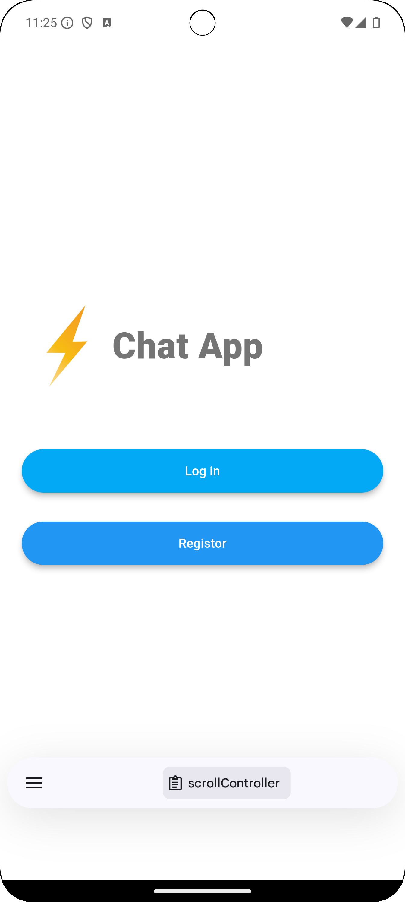
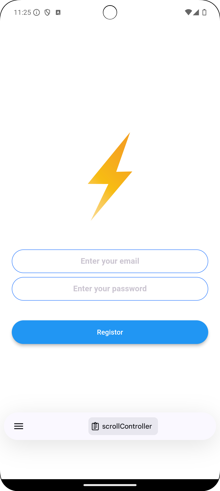
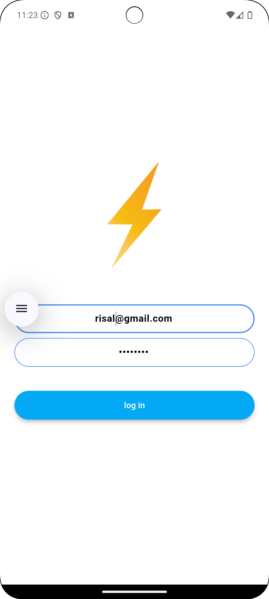
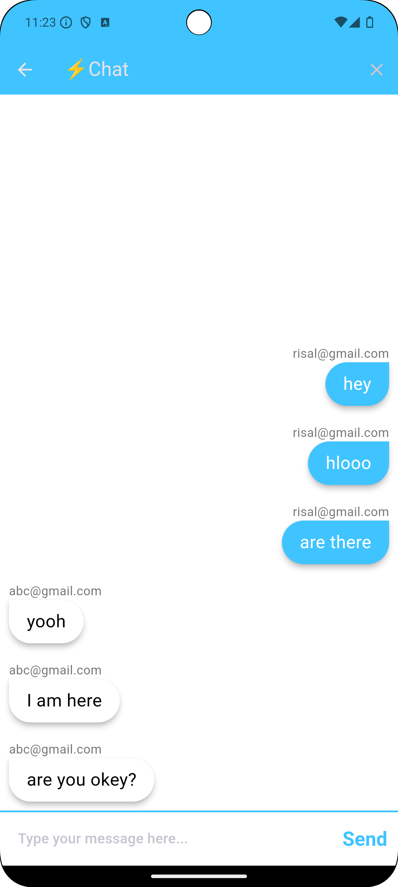
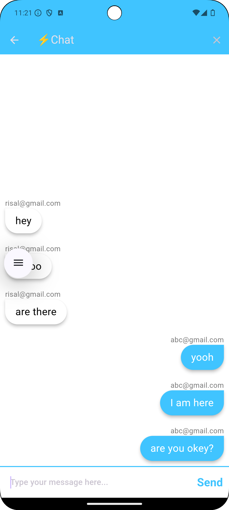

# Chat App

Chat is a real-time chat application built using Flutter and Firebase. This app allows users to register, log in, and send messages in real time. The application features a simple and intuitive UI, ensuring a smooth user experience.

## Features

- **User Authentication**: Users can register and log in using email and password authentication through Firebase.
- **Real-Time Messaging**: Send and receive messages instantly using Firestore.
- **Animated Welcome Screen**: A visually appealing welcome screen with animations.
- **Rounded Buttons**: Custom styled buttons for a cohesive design.
- **Message Bubbles**: Messages are displayed in customizable bubbles, differentiating between sent and received messages.

## Tech Stack

- **Flutter**: For building the cross-platform mobile application.
- **Firebase**: For authentication and real-time database functionality.
- **Cloud Firestore**: To store and sync chat messages in real time.

## Screenshots

<p float="left">
  
  
  
</p>

<p float="left">
  
  
</p>

## Getting Started

To run the app locally, follow these steps:

### Prerequisites

- Flutter installed on your machine. Follow the [official Flutter installation guide](https://flutter.dev/docs/get-started/install).
- An active Firebase project. Create one at [Firebase Console](https://console.firebase.google.com/).

### Installation

1. Clone the repository:
   ```bash
   git clone https://github.com/risal-ea/chat-app.git
